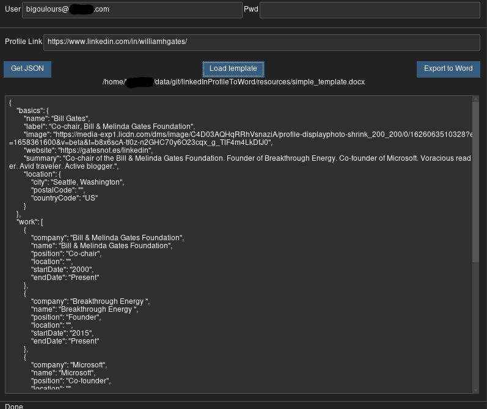
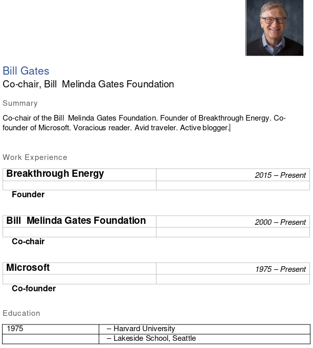

# linkedInProfileToWord
Export profiles from LinkedIn.\
Input is the person's LinkedIn Profile url.\
First converts profile to json-resume format and then exports it to a Word file using [docxtpl](https://github.com/elapouya/python-docx-template)\

Docx templates use the jinja2 syntax.
Feel free to improve and share your templates!
